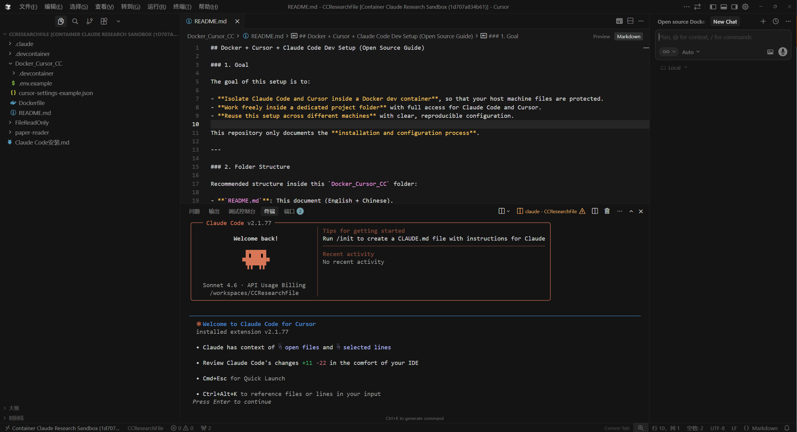

# Combined-use-of-Cursor-Docker-and-Claude-code

<p align="left">
  <b>English</b> | <a href="README_zh.md">CN 中文</a>
</p>

---



## Docker + Cursor + Claude Code Dev Setup (Open Source Guide)

### 1. Goal

The goal of this setup is to:

- **Isolate Claude Code and Cursor inside a Docker dev container**, so that your host machine files are protected.
- **Work freely inside a dedicated project folder** with full access for Claude Code and Cursor.
- **Reuse this setup across different machines** with clear, reproducible configuration.

This repository only documents the **installation and configuration process**.

---

### 2. Folder Structure

Recommended structure inside this `Docker_Cursor_CC` folder:

- **`README.md`**: This document (English + Chinese).
- **`.devcontainer/devcontainer.json`**: VS Code / Cursor dev container configuration.
- **`Dockerfile`**: Base image and tools used inside the dev container.
- **`cursor-settings-example.json`**: Example Cursor settings related to safety and behavior.
- **`.env.example`**: Environment variables needed inside the container (placeholders, no secrets).

You can copy this whole folder into any project and adjust names and paths as needed.

---

### 3. Prerequisites

- **Operating system**: Windows, macOS, or Linux.
- **Docker**:
  - Official docs: `https://docs.docker.com/get-docker/`
  - Example video tutorial (Chinese, Bilibili): `https://www.bilibili.com/video/BV1xHA3euEcn`
- **Cursor**:
  - Official site: `https://www.cursor.com/`
  - Install Cursor from the official website and log in.
- **Claude API key (official)**:
  - Sign up and create an API key on the official Anthropic website: `https://console.anthropic.com/`
  - **Important**: Do not hard‑code API keys into files. Use environment variables (see `.env.example`).

This guide intentionally **does not** use any third‑party or gray‑area relay sites. Please follow the official Anthropic documentation and your local regulations.

---

### 4. Step‑by‑Step Setup

#### 4.1 Clone or copy this folder

1. Put the `Docker_Cursor_CC` folder under your main workspace (for example under `~/code` or any directory you want).
2. Open the folder in **Cursor**.

> You should see the `.devcontainer` folder and `Dockerfile` in the root of this project.

#### 4.2 Configure environment variables (no secrets committed)

1. Copy `.env.example` to `.env`:

```bash
cp .env.example .env
```

2. Edit `.env` and fill in your real values **on your own machine**:

- `ANTHROPIC_API_KEY`: your official Claude API key.

> **Do not commit `.env` to git**. It is intentionally excluded from this open‑source folder and should stay local.

#### 4.3 Build and start the dev container

Cursor can automatically detect `.devcontainer/devcontainer.json`.

1. In Cursor, choose **“Reopen in Container”** (or similar dev container option).
2. Cursor will:
   - Build the `Dockerfile`.
   - Start the container.
   - Mount your project folder into the container (only this folder is fully accessible to tools).

Once the dev container is running, any terminal you open within Cursor will execute **inside** the container.

#### 4.4 Install Claude Code inside the container

Inside the dev container terminal:

```bash
pipx install claude-code
```

Or, if you prefer:

```bash
pip install --user claude-code
```

Official / community learning resources about Claude Code:

- Example Bilibili tutorial: `https://www.bilibili.com/video/BV14rzQB9EJj`
- Official Anthropic docs: `https://docs.anthropic.com/`


#### 4.5 Configure Cursor & Claude Code behavior

1. In Cursor, open `cursor-settings-example.json`.
2. Copy relevant parts into your actual Cursor settings (inside Cursor: **Settings → Advanced → Open settings.json**).
3. Adjust:
   - Whether Claude Code can auto‑apply edits.
   - Whether to require confirmation before modifying files.
   - Any additional safety or workspace‑scope settings.

> The included example is conservative by default: it prefers **asking before modifying files**, which is safer if you are new to the tool.

---

### 5. Security & Safety Recommendations

- **Run Claude Code only inside the dev container**:
  - Open terminals **in Cursor’s dev container**.
  - Avoid running `claude-code` directly on your host whenever possible.
- **Limit what is mounted**:
  - The `.devcontainer/devcontainer.json` provided here mounts only the project folder by default.
  - Do not mount your entire home directory unless you know exactly what you are doing.
- **Avoid dangerous flags unless you fully understand them**:
  - For example, `claude --dangerously-skip-permissions` removes interactive safety prompts and allows broad edits. Use with caution, and preferably only in **throwaway or version‑controlled** environments.
- **Keep secrets out of the repository**:
  - Use `.env` locally.
  - Use environment variables configuration in Docker / devcontainer, never commit real API keys.

---

### 6. Useful Official Links

- **Docker**:
  - Docs: `https://docs.docker.com/`
- **Cursor**:
  - Site: `https://www.cursor.com/`
- **Anthropic Claude API & Claude Code**:
  - Console: `https://console.anthropic.com/`
  - Docs: `https://docs.anthropic.com/`

You can adapt or extend this folder structure to fit your own workflows (for example, adding MCP tools, plugins, or additional devcontainer features).

---